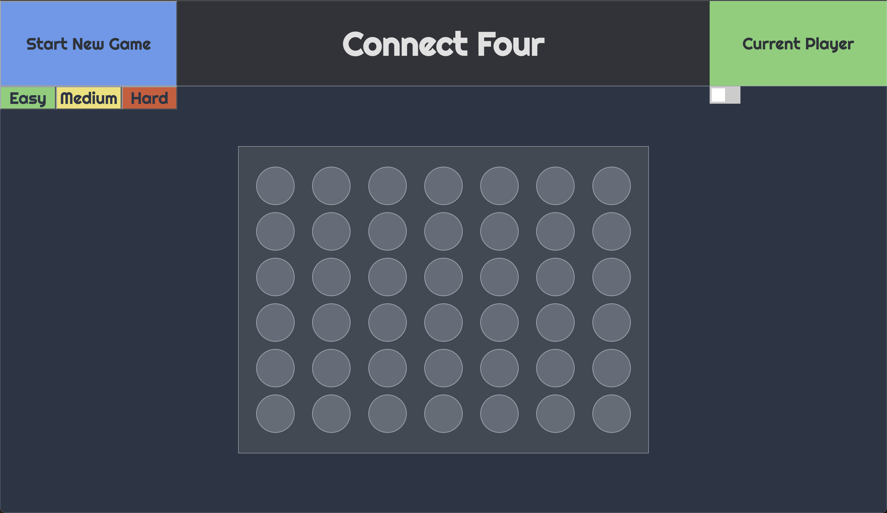

# Connect Four 

Players take turns placing pieces on a 7x6 game board. When a column is picked, the player's piece is placed at the *bottom-most* game slot of that column. The first player to place four of their pieces in a row wins the game. 

### Instructions

- Click anywhere on the board to begin playing.

- Pick a difficulty level (optional).

- Toggle music on and off.

- Press "Start New Game" at any time to reset the game board.

[Start playing!](https://woojinv.github.io/Project-1-Connect-Four/)

## What I learned

I became more comfortable with the Model-View-Controller design pattern, DOM manipulation for interactivity with JavaScript, Chrome Developer Tools to debug and style, and utilizing sound effects to create an immersive experience.

This was my first real project and I learned that I truly enjoy programming. Every bug that I was able to fix gave me such a sense of joy and satisfaction that confirmed my choice to switch into this industry.

## Screenshots

## Technologies Used

JavaScript, CSS, HTML

## Next Steps

- User account implementation to store statistics and game history.

- Ability to face players online. 

- AI implementation with difficulty settings

