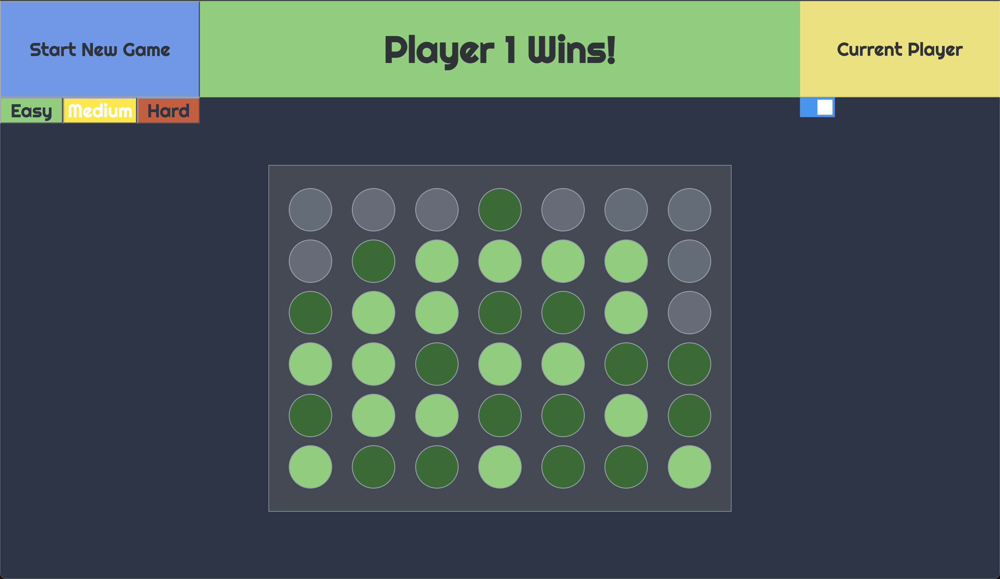

# Connect Four 

Players take turns placing pieces on a 7x6 game board. When a column is picked, the player's piece is placed at the *bottom-most* game slot of that column. The first player to place four of their pieces in a row wins the game. 

### Instructions

- Click anywhere on the board to begin playing.

- Pick a difficulty level (optional).

- Toggle music on and off.

- Press "Start New Game" at any time to reset the game board.

[Start playing!](https://woojinv.github.io/Connect-Four/)

 

## Screenshots

 

## Technologies Used

JavaScript, CSS, HTML

 

## Next Steps

- User account implementation to store statistics and game history.

- Ability to face players online. 

- AI implementation with difficulty settings

